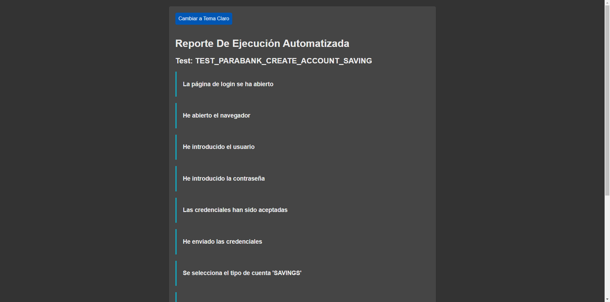

# 🤖 Proyecto de Automatización con Robot Framework 🚀

## 📖 Introducción

Robot Framework es un marco de trabajo (framework) de código abierto para la automatización de pruebas y la automatización de procesos de aceptación (ATDD, Acceptance Test-Driven Development). Es utilizado para automatizar pruebas funcionales, pruebas de aceptación, pruebas de sistemas, etc.

Puntos clave sobre Robot Framework:

1. **Sintaxis Simple y Legible**: Robot Framework utiliza una sintaxis simple basada en palabras clave (keywords) que facilita la escritura y lectura de pruebas, incluso para personas sin un fondo técnico fuerte.

2. **Extensible**: Puede ser extendido con bibliotecas (libraries) externas, que pueden ser implementadas en Python o Java. Esto permite a los usuarios añadir funcionalidades específicas o interactuar con sistemas y aplicaciones de una manera personalizada.

3. **Integración con Herramientas Existentes**: Robot Framework puede integrarse con otras herramientas populares de pruebas y CI/CD como Selenium, Appium, Jenkins, entre otras.

4. **Rico en Funcionalidades**: Ofrece una amplia variedad de funcionalidades out-of-the-box, incluyendo la gestión de variables, la configuración de la suite de pruebas, la ejecución condicional, entre otros.

5. **Reportes y Logs**: Genera informes y logs detallados y de fácil lectura que ayudan en la identificación y solución de problemas.

6. **Multiplataforma**: Funciona en la mayoría de los sistemas operativos y puede automatizar aplicaciones web, móviles y de escritorio.

Visita el [sitio oficial de Robot Framework](https://robotframework.org) para mas información.

## Comparación 📊

A continuación, se presenta una tabla comparativa y un resumen de por qué Robot Framework es una buena opcion en comparación con otros frameworks para pruebas automatizadas:

| Característica     | Robot Framework                                                                                                           | Selenium                                                                                                                   | Cypress                                                                                                                   | Puppeteer                                                                                                           | Playwright                                                                                                           | WebDriverIO                                                                                                         | TestCafe                                                                                                                     | Protractor                                                                                                                       |
|---------------------|----------------------------------------------------------------------------------------------------------------------------|----------------------------------------------------------------------------------------------------------------------------|----------------------------------------------------------------------------------------------------------------------------|--------------------------------------------------------------------------------------------------------------------|---------------------------------------------------------------------------------------------------------------------|--------------------------------------------------------------------------------------------------------------------|--------------------------------------------------------------------------------------------------------------------------------|----------------------------------------------------------------------------------------------------------------------------------|
| Flexibilidad       | - Soporte para múltiples lenguajes de programación.<br>- Gran cantidad de librerías y extensiones disponibles.           | - Soporta múltiples lenguajes de programación como Java, C#, Python.                                                       | - Diseñado específicamente para aplicaciones web modernas.<br>- Enfoque en simplicidad y eficiencia durante el desarrollo. | - API de alto nivel para controlar Chrome o Chromium.<br>- Ideal para pruebas de páginas con JavaScript moderno.  | - Soporte multi-navegador para pruebas automatizadas.<br>- Incluye características modernas de la web.              | - Implementa el protocolo WebDriver y ofrece una API simplificada para escribir pruebas automatizadas.              | - No necesita WebDriver.<br>- Entorno de prueba que se ejecuta en varios navegadores y sistemas operativos.             | - Especializado en aplicaciones Angular y AngularJS.<br>- Integración con Selenium.                                               |
| Facilidad de Uso   | - Sintaxis fácil basada en palabras clave.<br>- Curva de aprendizaje suave para usuarios nuevos.                           | - Amplia adopción y documentación disponible.<br>- Sin embargo, requiere conocimientos de programación.                    | - Fácil de aprender y usar.<br>- Menos curva de aprendizaje en comparación con Selenium.                                  | - Documentación clara y API de alto nivel.<br>- Facilidad para automatizar tareas complejas.                        | - Sintaxis simple y fácil de usar.<br>- Mejor legibilidad del código en comparación con Puppeteer.                | - Amplia documentación y comunidad activa.<br>- Sin embargo, configuración inicial puede ser compleja.               | - Fácil de instalar y configurar.<br>- Interacción automática con elementos de la página web.                        | - Especializado en aplicaciones Angular.<br>- Sin embargo, puede ser menos intuitivo para usuarios nuevos.                      |
| Integración       | - Integración con Selenium para pruebas web.<br>- Puede utilizar bibliotecas de Selenium para casos específicos.          | - Integración nativa con Selenium.<br>- Permite utilizar bibliotecas y herramientas de Selenium.                          | - No requiere integración con herramientas externas.<br>- Funciona independientemente como framework de pruebas.           | - Integración con Chrome o Chromium a través del Protocolo DevTools.                                               | - Soporte para integración con herramientas de CI/CD y otros frameworks de pruebas.                                 | - Integración con herramientas de CI/CD y plataformas de pruebas en la nube.                                       | - Integración con herramientas de CI/CD.<br>- Permite ejecución en paralelo y gestión de sesiones.                       | - Integración con Selenium.<br>- Especializado en aplicaciones Angular y AngularJS.                                                |
| Adaptabilidad     | - Capacidad para adaptarse a diferentes tecnologías y entornos de pruebas.                                                | - Puede automatizar una amplia variedad de aplicaciones web.<br>- Sin embargo, puede requerir más configuración inicial.  | - Especialmente diseñado para aplicaciones web modernas.<br>- Menos adaptable a otros tipos de aplicaciones.               | - Ideal para pruebas de páginas web que requieren JavaScript moderno.<br>- Menos adaptable a otros navegadores.       | - Soporte multi-navegador y capacidades modernas de la web.<br>- Puede adaptarse a diferentes entornos de pruebas.  | - Puede automatizar una amplia variedad de aplicaciones web.<br>- Sin embargo, puede requerir más configuración inicial. | - Puede automatizar una amplia variedad de aplicaciones web.<br>- Sin embargo, menos adaptable a otros navegadores.     | - Especializado en aplicaciones Angular y AngularJS.<br>- Menos adaptable a otras tecnologías web.                              |

En resumen, Robot Framework ofrece una combinación única de flexibilidad, facilidad de uso, integración y adaptabilidad que lo distingue como una excelente opción para proyectos de automatización de pruebas web.

## ☑️ Requisitos

Para que este proyecto funcione necesitamos:

- [Python](https://www.python.org/downloads/) (>=3.9)
- Tu navegador favorito como: [GoogleChrome](https://www.google.com/intl/es-419/chrome/), [FireFox](https://www.mozilla.org/es-MX/firefox/new/), etc
- Algún controlador web de tu navegador favorito como: [ChromeDriver](https://chromedriver.chromium.org/downloads), [GeckoDriverFirefox](https://github.com/mozilla/geckodriver/releases)

NOTA: El controlador web debe ser del navegador que vas a utilizar, ejemplo: chrome == chromedriver

## 🔗 Instalación

Los módulos que usamos en este proyecto los gestionamos con [Poetry](https://python-poetry.org/), para instalarlo ejecutaremos el comando:

- `pip install poetry==1.7.1`

Hecho esto, podremos instalar las dependencias para ejecución:

- `poetry install`

## 📦 Gestión de dependencias

Si necesitas agregar más dependencias, puedes hacerlo con el comando:

- `poetry add <nombre-de-la-dependencia>`

Si necesitas eliminar dependencias, puedes hacerlo con el comando:

- `poetry remove <nombre-de-la-dependencia>`

## ⚙ Configuración

Es necesario hacer algunas cosas mas para que puedas ejecutar:

- Guarda en una carpeta el ejecutable del controlador web que hayas elegido
- Agregar a las variables de entorno **PATH** (Sistema o usuario) la ruta de la carpeta donde esta dicho controlador.

NOTA: Algunas veces es necesario reiniciar la consola de comandos que vayas a utilizar.

## 📁 Estructura de Carpetas

Este proyecto de scripts automatizados se implementaron varios patrones de arquitectura de pruebas:

- **Page Object Model (POM):** Este patrón se utiliza para mejorar el mantenimiento de las pruebas y reducir la duplicación de código. Los objetos de cada página de la aplicación se representan como archivos .resource en la carpeta pages. Estos objetos se adaptan a las palabras clave para su uso en los casos de prueba.

- **Data Driven Testing (DDT):** Este patrón permite que los casos de prueba se ejecuten con diferentes conjuntos de datos. Los archivos de datos para DDT se almacenan en la carpeta data. Según el número total de filas en el archivo CSV, se ejecutará la suite de pruebas correspondiente.

- **Keyword Driven:** Este patrón implica la definición de palabras clave personalizadas que representan acciones de nivel superior que se pueden utilizar en los casos de prueba. Las palabras clave se almacenan en la carpeta keywords y se invocan desde los casos de prueba.

- **Workflow Pattern:** Este patrón se utiliza para definir una secuencia de pasos (o "flujo de trabajo") que se deben seguir en un caso de prueba. En este proyecto, los flujos de trabajo se definen en la carpeta tests, que contiene los casos de prueba que se ejecutarán.

```bash
project/
--libraries/ # librerías externas
--data/ # los archivos de datos para DDT
--pages/ # los archivos .resource que representaran los objetos de cada pagina de la aplicacion (adaptada a keywords)
--keywords/ # las palabras clave que se usaran para invocarse desde los casos de prueba
--tests/ # los casos de prueba que se ejecutaran
--workflows/ # los flujos complejos y secuenciales del proyecto
```

## 🚀 Ejecución de Pruebas

Para ejecutar las pruebas, abrir la terminal en la carpeta raiz y ejecutar:

- `poetry run robot ...[options] [file]`

Por ejemplo:

- `poetry run robot --outputdir output\robot tests\account.robot`

Tambien es posible agregar el comando `--listener` para agregar un reporte del paso a paso de la ejecucion.

- `poetry run robot --outputdir output\robot --listener .\libraries\HtmlTestStepLogReport.py tests\account.robot`

Se puede especificar mas de un tipo de reporte de evidencia en el mismo comando:

- `poetry run robot --outputdir output/robot --listener .\libraries\HtmlTestStepLogReport.py --listener .\libraries\HtmlTestStepSilderReport.py tests\account.robot`

## Reportes

Robot Framework ya ofrece reportes de ejecución de test cases, pero no ofrece un reporte de los pasos de ejecución de un test case.

Consideraciones:
- El reporte se genera en un archivo de log con el mismo nombre del test case.
- El reporte se genera en la carpeta ./base/output/reports/
- Es posible convinar los 3 reportes

Hay 2 listeners que podremos usar para generar reportes de los pasos de ejecución de un test case:
- HtmlTestStepLogReport.py: Genera un reporte de los pasos de ejecución de un test case en un archivo html.
- HtmlTestStepSliderReport.py: Genera un reporte de los pasos de ejecución de un test case en un archivo html con imágenes.

### HtmlTestStepLogReport

En este listener es posible generar un reporte de los pasos de ejecución de un test case. Para agregar un paso al reporte, se debe agregar el tag STEP: en la keyword o en el mensaje de log. El mensaje se puede usar para reportar información adicional de un paso, como por ejemplo, el valor de una variable, el resultado de una operación, etc.

El reporte se genera en la carpeta output/reports/report_step_log/ y se genera un archivo HTML por cada test que se ejecute.

Para utilizar el listener, se debe especificar como listener al ejecutar las pruebas:

- `robot --listener .\libraries\HtmlTestStepLogReport.py tests`

Ejemplo:
```robotframework
*** Keywords ***
My Keyword
    [Tags]  STEP:DESCRIPCIÓN DEL PASO:INFO
    No Operation

My Other Keyword
    [Tags]  STEP:DESCRIPCIÓN DEL PASO 2
    No Operation

My Other Keyword
    [Tags]  STEP:DESCRIPCIÓN DEL PASO 3:FAIL
    No Operation
```

Los estatus posibles son:
- INFO
- PASS
- CRITICAL
- FAIL
- FATAL
- WARNING
- DEBUG

El valor predeterminado es INFO.

También es posible utilizar la keyword Log con la misma estructura de tags.

Consideraciones:

- Si bien se puede usar STEP: para definir un paso también se tomara en cuenta STEP:IMAGE: para agregar un paso en este reporte pero no tomara la captura de pantalla, esto con el fin de poder reutilizar la misma descripción de paso en diferentes reportes.



### HtmlTestStepSliderReport

En este listener es posible generar un reporte de pasos con imágenes. Para agregar una imagen a un paso, se debe agregar el tag STEP:IMAGE: en el mensaje. El mensaje se puede usar para reportar información adicional de un paso, como por ejemplo, el valor de una variable, el resultado de una operación, etc.

El reporte se genera en la carpeta output/reports/report_step_slider/ y se genera un archivo HTML por cada test que se ejecute.

Para utilizar el listener, se debe especificar como listener al ejecutar las pruebas:

- `robot --listener HtmlTestStepSliderReport.py tests`

Ejemplo:

```robotframework
*** Keywords ***
My Keyword
    [Tags]  STEP:IMAGE:DESCRIPCIÓN DEL PASO:INFO
    No Operation

My Other Keyword
    [Tags]  STEP:IMAGE:DESCRIPCIÓN DEL PASO 2
    No Operation

My Other Keyword
    [Tags]  STEP:IMAGE:DESCRIPCIÓN DEL PASO 3:FAIL
    No Operation
```

Los estatus posibles son:

- INFO
- PASS
- CRITICAL
- FAIL
- FATAL
- WARNING
- DEBUG

El valor predeterminado es INFO.

También es posible utilizar la keyword Log con la misma estructura de tags.

Este reporte tiene la misma estructura que el HtmlTestStepLogReport.py, pero con la diferencia de que se agrega una imagen a los pasos.


## Datos de prueba

Esta librería esta hecho con el fin de reducir la declaración de variables en el archivo de pruebas, ya que se puede crear un DataTable a partir de un archivo CSV y acceder a los datos de la fila como atributos del objeto. Se crean dataclasses dinamicas en base a un archivo csv.

Un DataTable es una estructura de datos que representa una tabla de datos. Este se crea a partir de una lista de diccionarios, donde cada diccionario representa una fila de la tabla y este mismo diccionario se convierte en un dataclass para poder acceder a los datos de la fila como atributos del objeto. 🗂️➡️📊

Un `dataclass` es una funcionalidad de Python 3.7 que simplifica la creación de clases para almacenar datos. Mediante el módulo `dataclasses`, automatiza la generación de métodos como `__init__()`, `__repr__()`, `__eq__()`, y `__hash__()`, esenciales en clases usadas principalmente como contenedores de datos. 🐍

### Importar la librería 📚

```robotframework
*** Settings ***
Library    ./libraries/DataTableLibrary.py
```

### Crear un DataTable ✍️
Con los siguientes datos de prueba:

```csv
name,age,city,country
John Doe,30,New York,USA
Jane Doe,25,San Francisco,USA
```

```robotframework
*** Test Cases ***
Create DataTable
    ${table}=    Create Data Table    ${CURDIR}/data.csv    0
    Log    ${table}
    Log    ${table.name}
    Log    ${table.age}
    Log    ${table.city}
    Log    ${table.country}
```

### Agregar un campo al DataTable ➕

Con los siguientes datos de prueba:

```csv
name,age,city,country
John Doe,30,New York,USA
Jane Doe,25,San Francisco,USA
```

Se puede agregar un campo al DataTable de la siguiente manera:

```robotframework
*** Test Cases ***
Add Field
    ${table}=    Create Data Table    ${CURDIR}/data.csv    0
    ${new_table}=    Update Data Table    ${table}   is_active=True
    Log    ${new_table.is_alive}
```

Dando como resultado:

`DataTable(name='John Doe', age='30', city='New York', country='USA', is_active='True')`

También es posible agregar varios campos al DataTable:
    
```robotframework
*** Test Cases ***
Add Field
    ${table}=    Create Data Table    ${CURDIR}/data.csv    0
    ${new_table}=    Update Data Table    ${table}   is_active=True     account_type=premium
```

Dando como resultado:

`DataTable(name='John Doe', age='30', city='New York', country='USA', is_active='True', account_type='premium')`

### Consideraciones 🤔

- El índice de la fila inicia en 0.
- Los nombres de las columnas del archivo de datos deben ser únicos. 🚫🔁
- Los nombres de las columnas del archivo de datos no deben contener espacios en blanco. 🚫🛑
- Los nombres de las columnas del archivo de datos no deben contener tildes ni caracteres especiales. 🚫✨

## Resultados
Al ejecutar nuestras pruebas obtendremos datos que quizas querramos guardar para su posterior uso, por ejemplo: un id, un nombre, etc.

Este proyecto implementa una librería que permite guardar la información de la ejecución de los tests en un archivo de datos. 📁🔍

Las funcionalidades se integran con la librería DataTableLibrary.py de este proyecto, es decir, se puede utilizar un DataTable para guardar la información de la ejecución de los tests, sin embargo, se puede adaptar a cualquier estructura de datos. 🔄

Estos resultados se guardarán por ejecución y no por caso de prueba, es decir, si se ejecutan 3 test cases, se guardarán los resultados de los 3 test cases en un solo archivo de datos. 📊

### Importar la librería 📚

```robotframework
*** Settings ***
Library    ./libraries/TestsExecutionResults.py
```

### Guardar los resultados de la ejecución de los tests 💾
Dada la siguiente DataTable:

`${dt}    VAR    DataTable(name="Foo", age=12, city="New York", country="EUA", email="fake@mail.com", phone="5565656565")`

Se puede guardar la información de la siguiente manera:

```robotframework
Save Test Execution Results    ${dt}
```

Y esto generará un archivo CSV con el nombre del test suite con el siguiente contenido:

```csv
name,age,city,country,email,phone
Foo,12,New York,EUA,fake@mail.com,5565656565
```

Y una vez creado este archivo la información se agregará a este mismo hasta que se termina la ejecución. 🔄

### Guardar DataTables con diferentes campos 🔀
Se puede guardar DataTables con diferentes campos en el mismo archivo de datos, por ejemplo:

```robotframework
*** Settings ***
Library    ./libraries/TestsExecutionResults.py

*** Variables ***
${dt1}    DataTable(name="Foo", age=12, city="New York", country="EUA", email="fake@mail.com")
${dt2}    DataTable(name="Bar", age=24, city="Los Angeles", country="EUA", email="fake@mail.com", phone="5565656565")
```

Se puede guardar la información de la siguiente manera:
```robotframework
*** Test Cases ***
Test 1
    Save Test Execution Results    ${dt1}

Test 2
    Save Test Execution Results    ${dt2}
```

Y esto generará un archivo CSV con el nombre del test suite con el siguiente contenido:
```
name,age,city,country,email,phone
Foo,12,New York,EUA,fake@mail.com,
Bar,24,Los Angeles,EUA,fake@mail.com,5565656565
```

El campo que no tenía el DataTable 1 se agregó como vacío. ➖

### Trabajar con diccionarios 📚➡️🔍
Se puede trabajar con diccionarios en lugar de DataTables, por ejemplo:

```robotframework
*** Settings ***
Library    ./libraries/TestsExecutionResults.py

*** Variables ***
${dt1}    {"name": "Foo", "age": 12, "city": "New York", "country": "EUA", "email": ""}
```

Se puede guardar la información de la siguiente manera:

```robotframework
*** Test Cases ***
Test 1
    Save Test Execution Results    ${dt1}
```

### Consideraciones 🤔

- El nombre del archivo de datos será TestExecutionResults[index].csv. 📄
- Se debe invocar una vez por bloque de test cases, es decir, si se tienen 3 test cases, se debe invocar una vez por bloque de test cases. Si se invoca más de una vez, se sobrescribirá el archivo de datos. ⚠️
- Los campos que no estaban en el DataTable anterior se agregarán al final ➡️
- Se recomienda invocar la keyword `Save Test Execution Results` al final de cada bloque de test cases, para evitar que se sobrescriba el archivo de datos. 🛑

## 📊 Análisis de código

Un linter es una herramienta utilizada para analizar automáticamente el código fuente en busca de errores.

En este proyecto se utilizo el linter de [RoboCop](https://github.com/MarketSquare/robotframework-robocop).

Para obtener el análisis del código, hay que estar en la carpeta raíz del proyecto y ejecutar el comando:

- `poetry run robocop`

Este comando generara en la terminal un resumen de todos los issues encontrados
