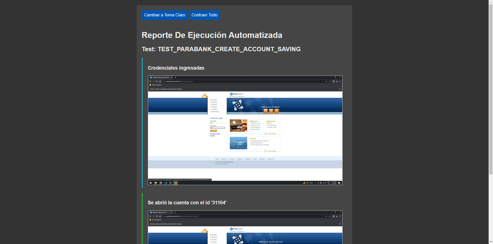
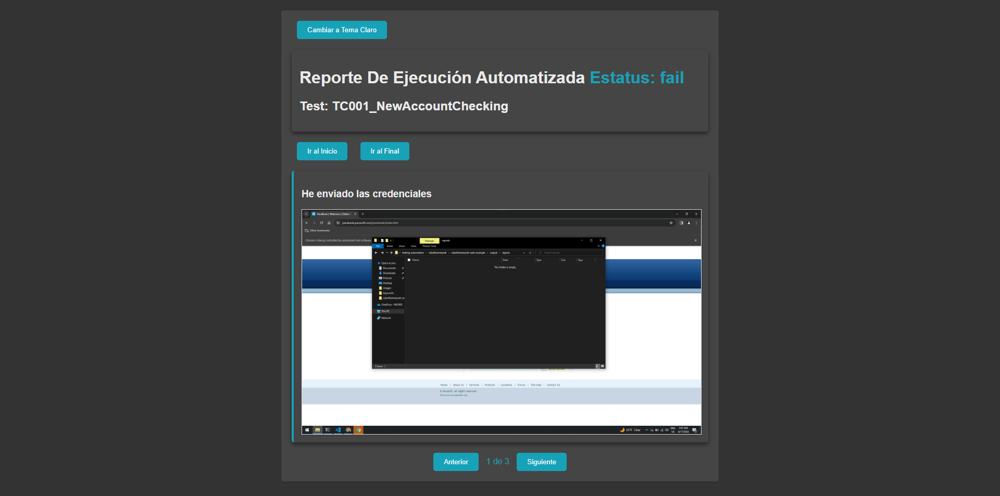
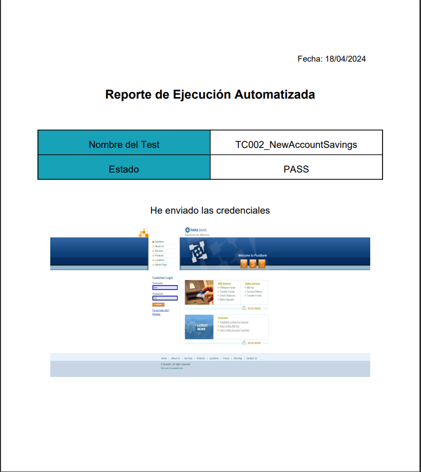
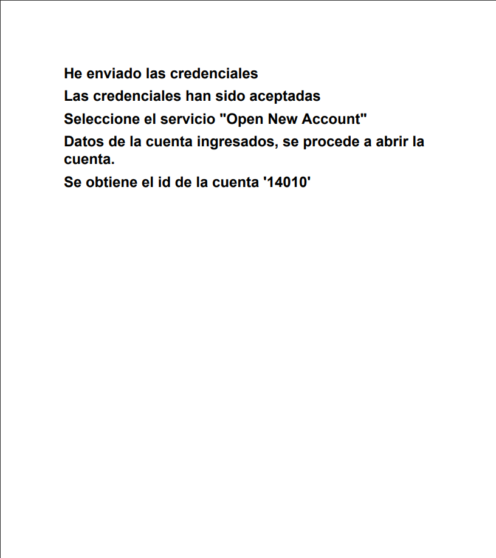

# 🤖 Proyecto de Automatización con Robot Framework 🚀

## 📖 Introducción

Robot Framework es un marco de trabajo (framework) de código abierto para la automatización de pruebas y la automatización de procesos de aceptación (ATDD, Acceptance Test-Driven Development). Es utilizado para automatizar pruebas funcionales, pruebas de aceptación, pruebas de sistemas, etc.

Puntos clave sobre Robot Framework:

1. **Sintaxis Simple y Legible**: Robot Framework utiliza una sintaxis simple basada en palabras clave (keywords) que facilita la escritura y lectura de pruebas, incluso para personas sin un fondo técnico fuerte.

2. **Extensible**: Puede ser extendido con bibliotecas (libraries) externas, que pueden ser implementadas en Python o Java. Esto permite a los usuarios añadir funcionalidades específicas o interactuar con sistemas y aplicaciones de una manera personalizada.

3. **Integración con Herramientas Existentes**: Robot Framework puede integrarse con otras herramientas populares de pruebas y CI/CD como Selenium, Appium, Jenkins, entre otras.

4. **Rico en Funcionalidades**: Ofrece una amplia variedad de funcionalidades out-of-the-box, incluyendo la gestión de variables, la configuración de la suite de pruebas, la ejecución condicional, entre otros.

5. **Reportes y Logs**: Genera informes y logs detallados y de fácil lectura que ayudan en la identificación y solución de problemas.

6. **Multiplataforma**: Funciona en la mayoría de los sistemas operativos y puede automatizar aplicaciones web, móviles y de escritorio.

Visita el [sitio oficial de Robot Framework](https://robotframework.org) para mas información.

## Comparación 📊

A continuación, se presenta una tabla comparativa y un resumen de por qué Robot Framework es una buena opcion en comparación con otros frameworks para pruebas automatizadas:

| Característica     | Robot Framework                                                                                                           | Selenium                                                                                                                   | Cypress                                                                                                                   | Puppeteer                                                                                                           | Playwright                                                                                                           | WebDriverIO                                                                                                         | TestCafe                                                                                                                     | Protractor                                                                                                                       |
|---------------------|----------------------------------------------------------------------------------------------------------------------------|----------------------------------------------------------------------------------------------------------------------------|----------------------------------------------------------------------------------------------------------------------------|--------------------------------------------------------------------------------------------------------------------|---------------------------------------------------------------------------------------------------------------------|--------------------------------------------------------------------------------------------------------------------|--------------------------------------------------------------------------------------------------------------------------------|----------------------------------------------------------------------------------------------------------------------------------|
| Flexibilidad       | - Soporte para múltiples lenguajes de programación.<br>- Gran cantidad de librerías y extensiones disponibles.           | - Soporta múltiples lenguajes de programación como Java, C#, Python.                                                       | - Diseñado específicamente para aplicaciones web modernas.<br>- Enfoque en simplicidad y eficiencia durante el desarrollo. | - API de alto nivel para controlar Chrome o Chromium.<br>- Ideal para pruebas de páginas con JavaScript moderno.  | - Soporte multi-navegador para pruebas automatizadas.<br>- Incluye características modernas de la web.              | - Implementa el protocolo WebDriver y ofrece una API simplificada para escribir pruebas automatizadas.              | - No necesita WebDriver.<br>- Entorno de prueba que se ejecuta en varios navegadores y sistemas operativos.             | - Especializado en aplicaciones Angular y AngularJS.<br>- Integración con Selenium.                                               |
| Facilidad de Uso   | - Sintaxis fácil basada en palabras clave.<br>- Curva de aprendizaje suave para usuarios nuevos.                           | - Amplia adopción y documentación disponible.<br>- Sin embargo, requiere conocimientos de programación.                    | - Fácil de aprender y usar.<br>- Menos curva de aprendizaje en comparación con Selenium.                                  | - Documentación clara y API de alto nivel.<br>- Facilidad para automatizar tareas complejas.                        | - Sintaxis simple y fácil de usar.<br>- Mejor legibilidad del código en comparación con Puppeteer.                | - Amplia documentación y comunidad activa.<br>- Sin embargo, configuración inicial puede ser compleja.               | - Fácil de instalar y configurar.<br>- Interacción automática con elementos de la página web.                        | - Especializado en aplicaciones Angular.<br>- Sin embargo, puede ser menos intuitivo para usuarios nuevos.                      |
| Integración       | - Integración con Selenium para pruebas web.<br>- Puede utilizar bibliotecas de Selenium para casos específicos.          | - Integración nativa con Selenium.<br>- Permite utilizar bibliotecas y herramientas de Selenium.                          | - No requiere integración con herramientas externas.<br>- Funciona independientemente como framework de pruebas.           | - Integración con Chrome o Chromium a través del Protocolo DevTools.                                               | - Soporte para integración con herramientas de CI/CD y otros frameworks de pruebas.                                 | - Integración con herramientas de CI/CD y plataformas de pruebas en la nube.                                       | - Integración con herramientas de CI/CD.<br>- Permite ejecución en paralelo y gestión de sesiones.                       | - Integración con Selenium.<br>- Especializado en aplicaciones Angular y AngularJS.                                                |
| Adaptabilidad     | - Capacidad para adaptarse a diferentes tecnologías y entornos de pruebas.                                                | - Puede automatizar una amplia variedad de aplicaciones web.<br>- Sin embargo, puede requerir más configuración inicial.  | - Especialmente diseñado para aplicaciones web modernas.<br>- Menos adaptable a otros tipos de aplicaciones.               | - Ideal para pruebas de páginas web que requieren JavaScript moderno.<br>- Menos adaptable a otros navegadores.       | - Soporte multi-navegador y capacidades modernas de la web.<br>- Puede adaptarse a diferentes entornos de pruebas.  | - Puede automatizar una amplia variedad de aplicaciones web.<br>- Sin embargo, puede requerir más configuración inicial. | - Puede automatizar una amplia variedad de aplicaciones web.<br>- Sin embargo, menos adaptable a otros navegadores.     | - Especializado en aplicaciones Angular y AngularJS.<br>- Menos adaptable a otras tecnologías web.                              |

En resumen, Robot Framework ofrece una combinación única de flexibilidad, facilidad de uso, integración y adaptabilidad que lo distingue como una excelente opción para proyectos de automatización de pruebas web.

## ☑️ Requisitos

Para que este proyecto funcione necesitamos:

- [Python](https://www.python.org/downloads/) (>=3.9)
- Tu navegador favorito como: [GoogleChrome](https://www.google.com/intl/es-419/chrome/), [FireFox](https://www.mozilla.org/es-MX/firefox/new/), etc
- Algún controlador web de tu navegador favorito como: [ChromeDriver](https://chromedriver.chromium.org/downloads), [GeckoDriverFirefox](https://github.com/mozilla/geckodriver/releases)

NOTA: El controlador web debe ser del navegador que vas a utilizar, ejemplo: chrome == chromedriver

## 🔗 Instalación

Los módulos que usamos en este proyecto los gestionamos con [Poetry](https://python-poetry.org/), para instalarlo ejecutaremos el comando:

- `pip install poetry==1.7.1`

Hecho esto, podremos instalar las dependencias para ejecución:

- `poetry install`

## 📦 Gestión de dependencias

Si necesitas agregar más dependencias, puedes hacerlo con el comando:

- `poetry add <nombre-de-la-dependencia>`

Si necesitas eliminar dependencias, puedes hacerlo con el comando:

- `poetry remove <nombre-de-la-dependencia>`

## ⚙ Configuración

Es necesario hacer algunas cosas mas para que puedas ejecutar:

- Guarda en una carpeta el ejecutable del controlador web que hayas elegido
- Agregar a las variables de entorno **PATH** (Sistema o usuario) la ruta de la carpeta donde esta dicho controlador.

NOTA: Algunas veces es necesario reiniciar la consola de comandos que vayas a utilizar.

## 📁 Estructura de Carpetas

Este proyecto de scripts automatizados se implementaron varios patrones de arquitectura de pruebas:

- **Page Object Model (POM):** Este patrón se utiliza para mejorar el mantenimiento de las pruebas y reducir la duplicación de código. Los objetos de cada página de la aplicación se representan como archivos .resource en la carpeta pages. Estos objetos se adaptan a las palabras clave para su uso en los casos de prueba.

- **Data Driven Testing (DDT):** Este patrón permite que los casos de prueba se ejecuten con diferentes conjuntos de datos. Los archivos de datos para DDT se almacenan en la carpeta data. Según el número total de filas en el archivo CSV, se ejecutará la suite de pruebas correspondiente.

- **Keyword Driven:** Este patrón implica la definición de palabras clave personalizadas que representan acciones de nivel superior que se pueden utilizar en los casos de prueba. Las palabras clave se almacenan en la carpeta keywords y se invocan desde los casos de prueba.

- **Workflow Pattern:** Este patrón se utiliza para definir una secuencia de pasos (o "flujo de trabajo") que se deben seguir en un caso de prueba. En este proyecto, los flujos de trabajo se definen en la carpeta tests, que contiene los casos de prueba que se ejecutarán.

```bash
project/
--libraries/ # librerías externas
--data/ # los archivos de datos para DDT
--pages/ # los archivos .resource que representaran los objetos de cada pagina de la aplicacion (adaptada a keywords)
--keywords/ # las palabras clave que se usaran para invocarse desde los casos de prueba
--tests/ # los casos de prueba que se ejecutaran
--workflows/ # los flujos complejos y secuenciales del proyecto
```

## 🚀 Ejecución de Pruebas

Para ejecutar las pruebas, abrir la terminal en la carpeta raiz y ejecutar:

- `poetry run robot ...[options] [file]`

Por ejemplo:

- `poetry run robot --outputdir output\robot tests\account.robot`

Tambien es posible agregar el comando `--listener` para agregar un reporte del paso a paso de la ejecucion.

- `poetry run robot --outputdir output\robot --listener .\libraries\HtmlTestStepLogReport.py tests\account.robot`

Se puede especificar mas de un tipo de reporte de evidencia en el mismo comando:

- `poetry run robot --outputdir output/robot --listener .\libraries\HtmlTestStepLogReport.py --listener .\libraries\HtmlTestStepSilderReport.py tests\account.robot`

## Reportes

Robot Framework ya ofrece reportes de ejecución de test cases, pero no ofrece un reporte de los pasos de ejecución de un test case.

### Consideraciones
- El reporte se genera en un archivo de log con el mismo nombre del test case.
- El reporte se genera en la carpeta ./base/output/reports/
- Es posible desde no generar el reporte de todos los listeners.

Hay 5 listeners que podremos usar para generar reportes de los pasos de ejecución de un test case:
- **HtmlTestReportStepLog.py:** Genera un reporte de los pasos de ejecución de un test case en un archivo html.
- **HtmlTestReportStepSlider.py:** Genera un reporte de los pasos de ejecución de un test case en un archivo html con imágenes.
- **PdfTestReportStepLog.py:** Genera un reporte de los pasos de ejecución de un test case en un archivo pdf.
- **PdfTestReportStepSlider.py:** Genera un reporte de los pasos de ejecución de un test case en un archivo pdf con imágenes.
- **HtmlTestReportStepHorizontalSlider.py:** Genera un reporte de los pasos de ejecución de un test case en un archivo html con imágenes en horizontal.

Para utilizar estos listeners, se debe especificar como listener al ejecutar las pruebas:

- `robot --listener ./config/execution/HtmlTestReportStepLog.py tests`

En caso de querer agregar mas de un listener, se pueden agregar de la siguiente manera:

- `robot --listener ./config/execution/HtmlTestReportStepLog.py --listener ./config/execution/HtmlTestReportStepSlider.py tests`

Cada reporte se generara en la carpeta output/reports/ con el nombre del test case. Segun el listener que se use, se generara un archivo html o pdf en una carpeta especifica.

Las carpetas que crea cada listener son:

- **HtmlTestReportStepLog.py:** output/reports/report_step_log/
- **HtmlTestReportStepSlider.py:** output/reports/report_step_slider/
- **PdfTestReportStepLog.py:** output/reports/report_pdf_log/
- **PdfTestReportStepSlider.py:** output/reports/report_pdf_slider/
- **HtmlTestReportStepHorizontalSlider.py:** output/reports/report_horizontal_step_slider/

Pese a que hay 4 listeners, se pueden clasificar en 2 tipos: con imágenes y sin imágenes. Los listeners que contienen la palabra "Slider" generan reportes con imágenes, mientras que los otros generan reportes sin imágenes.

Para agregar un paso al reporte, dependera del listener que se este utilizando.

### Con imagenes
- Se deberan utilizar los prefijos `STEP:IMAGE`:, `STEP:CAPTURE`: y `STEP:ELEMENT`: en la keyword o en el mensaje de log.
- El mensaje se puede usar para reportar información adicional de un paso, como por ejemplo, el valor de una variable, el resultado de una operación, etc.
- El reporte se generara con una imagen por cada vez que se use uno de los prefijos.
- Con el fin de evitar el uso de libreas externas, se utilizara la keyword Log para agregar un paso al reporte. Ejemplo: `Log    STEP:IMAGE:DESCRIPCIÓN DEL PASO`
- `STEP:IMAGE:` se utilizara para agregar un paso con una imagen generada con la libreria PIL.
- `STEP:CAPTURE:` se utilizara para agregar un paso con una imagen capturada con la keyword Capture Page Screenshot de SeleniumLibrary. Nota: Primero se debe capturar la imagen con la keyword y luego se debe agregar el paso con el prefijo `STEP:CAPTURE:` o fallara.
- `STEP:ELEMENT:` se utilizara para agregar un paso con una imagen capturada de un elemento con la keyword `Capture Element Screenshot` de SeleniumLibrary. Nota: Primero se debe capturar la imagen con la keyword y luego se debe agregar el paso con el prefijo `STEP:ELEMENT:` o fallara.
- A parte de la keyword Log, se puede agregar el prefijo en las etiquetas de la keyword. Hacer esto tomara la captura hasta que la ultima keyword de donde se agrego el prefijo se ejecute.

### Sin imagenes
- Se deberan utilizar los prefijos `STEP:`
- El mensaje se puede usar para reportar información adicional de un paso, como por ejemplo, el valor de una variable, el resultado de una operación, etc.
- Los prefijos para imagenes tambien se tomaran en cuenta, pero no se tomara la captura de pantalla.
- Con el fin de evitar el uso de libreas externas, se utilizara la keyword Log para agregar un paso al reporte. Ejemplo: `Log    STEP:DESCRIPCIÓN DEL PASO`
- A parte de la keyword Log, se puede agregar el prefijo en las etiquetas de la keyword. Hacer esto tomara la captura hasta que la ultima keyword de donde se agrego el prefijo se ejecute.

Los estatus posibles son:
- **INFO:** Información general. Se utiliza para describir un paso. Contexto de ejemplo: "Se abre la página de inicio".
- **PASS:** Éxito. Se utiliza para describir un paso que se ejecuto correctamente. Contexto de ejemplo: "Se ingreso el usuario correctamente".
- **CRITICAL:** Error crítico. Se utiliza para describir un paso que fallo y no se puede continuar con la ejecución. Contexto de ejemplo: "No se pudo ingresar el usuario".
- **FAIL:** Error. Se utiliza para describir un paso que fallo pero se puede continuar con la ejecución. Contexto de ejemplo: "No se pudo ingresar el usuario".
- **FALTA:** Falta de implementación. Se utiliza para describir un paso que no se ha implementado. Contexto de ejemplo: "Falta implementar el ingreso de usuario".
- **WARNING:** Advertencia. Se utiliza para describir un paso que se ejecuto correctamente pero con advertencias. Contexto de ejemplo: "Se ingreso el usuario correctamente pero se tardo mucho".
- **DEBUG:** Depuración. Se utiliza para describir un paso que se ejecuto correctamente pero se necesita información adicional. Contexto de ejemplo: "Se ingreso el usuario correctamente. Se tardo 5 segundos".

El valor predeterminado es **INFO**.

Para asignarle un estatus a un paso, se debe agregar el estatus al final del prefijo. Ejemplo: `STEP:DESCRIPCIÓN DEL PASO:INFO`, `STEP:CAPTURE:DESCRIPCIÓN DEL PASO:FAIL`, `STEP:IMAGE:DESCRIPCIÓN DEL PASO:PASS`, `STEP:ELEMENT:DESCRIPCIÓN DEL PASO:CRITICAL`.

Esto hara que el color del paso en el reporte cambie segun el estatus.

```robotframework
Ejemplos de uso:
    *** Keywords ***
    My Keyword
        [Tags]  STEP:IMAGE:DESCRIPCIÓN DEL PASO:INFO
        No Operation

    My Other Keyword
        [Tags]  STEP:CAPTURE:DESCRIPCIÓN DEL PASO 2
        Capture Page Screenshot
        Log    STEP:CAPTURE:DESCRIPCIÓN DEL PASO 2

    My Another Keyword
        Capture Element Screenshot    xpath=//div[@id="foo"]
        Log    STEP:ELEMENT:DESCRIPCIÓN DEL PASO 3:FAIL
    
    My Last Keyword
        Log    STEP:DESCRIPCIÓN DEL PASO 4:CRITICAL
```

### Configuracion

Al importar SeleniumLibrary, es necesario modificar los siguientes argumentos:
- `screenshot_root_directory` a `./output/selenium_screenshots/`

Esto se hace para que las capturas de pantalla se guarden en la carpeta correcta y se puedan agregar al reporte.
Si no se hace esto, las capturas de pantalla se guardaran en la carpeta de logs de SeleniumLibrary y no se podran agregar al reporte.

Recomedacion: Ejecutar desde la carpeta base del proyecto para que al definir `screenshot_root_directory` se pueda definir de esta forma `${EXECDIR}/selenium_screenshots/`

### Ejemplos

#### HTML vertical con imagenes



#### HTML horizontal con imagenes



#### HTML vertical sin imagenes


#### PDF con imagenes



#### PDF sin imagenes



## DataTableLibrary.py

DataTableLibrary es una librería de Robot Framework que permite crear DataTables a partir de un archivo CSV o JSON y acceder a los datos de la fila como atributos del objeto.

Encuentra la documentacion completa en [./docs/keywords/DataTableLibrary.html](./docs/keywords/DataTableLibrary.html)

## TestsExecutionResults.py
TestsExecutionResults es una librería que permite guardar la información de la ejecución de los tests en un archivo de datos.

Las funcionalidades se integran con la librería DataTableLibrary.py de este proyecto, es decir, se puede utilizar un DataTable para guardar la información de la ejecución de los tests, sin embargo, se puede adaptar también a diccionarios.

Encuentra la documentacion completa en [./docs/keywords/TestsExecutionResults.html](./docs/keywords/TestsExecutionResults.html)

### HighLightLibrary.py 📚

Esta libreria permite resaltar elementos en la página web durante la ejecución de pruebas. ✨

Es util para resaltar elementos en la página web durante la ejecución de pruebas, para que los usuarios puedan ver claramente que elementos están siendo afectados por las pruebas. 👀

Encuentra la documentacion completa en [./docs/keywords/HighLighLibrary.html](./docs/keywords/HighLighLibrary.html)

## 📊 Análisis de código

Un linter es una herramienta utilizada para analizar automáticamente el código fuente en busca de errores.

En este proyecto se utilizo el linter de [RoboCop](https://github.com/MarketSquare/robotframework-robocop).

Para obtener el análisis del código, hay que estar en la carpeta raíz del proyecto y ejecutar el comando:

- `poetry run robocop`

Este comando generara en la terminal un resumen de todos los issues encontrados
